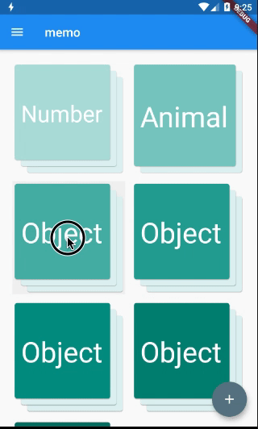
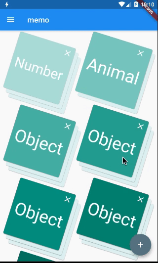
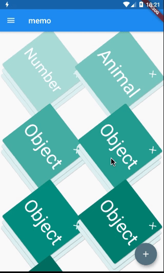
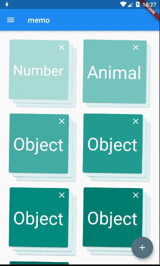
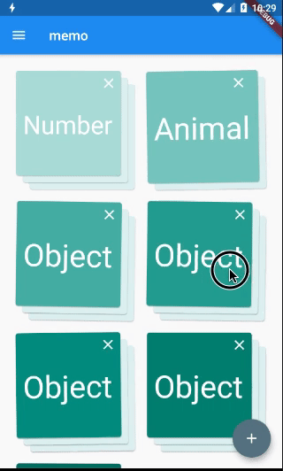
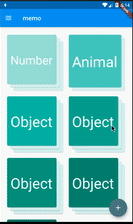

この記事は[Aizu Advent Calendar 2020](https://adventar.org/calendars/5037)の24日目の記事です。gif画像多めです。

# はじめに

どうも**しほみ**です。

あけましておめでとうございます。年明けにアドベント書くなという話なのですが、なかなか書けるまで時間がかかってしまいました。
久しぶりにこのポートフォリオページを振り返ったのですが、相変わらずひどいデザイン・・そのうち直したいです。

個人的に開発しているFlutterアプリでiosのあの動きを入れたいなーと思いまして、完成するまでの過程です。

アイコンを長押しすることガタガタ揺れるアレです。アレ

そう、これです。


こちらが動きを入れたいアプリの画面です。

今まだ長押しして削除アイコンが表示されるだけなのをガタガタ仕様にしたいと思います。




***
# Flutterのアニメーション

[公式APIリファレンス](https://api.flutter.dev/flutter/widgets/AnimatedBuilder-class.html)
ここでは連続的なアニメーション(反復運動)のみ言及します。ページ遷移など非連続的なものは[TweenAnimationBuilder](https://api.flutter.dev/flutter/widgets/TweenAnimationBuilder-class.html)を参考にしてください。

> Well-designed animations make a UI feel more intuitive, contribute to the slick look and feel of a polished app, and improve the user experience.
> [1](https://flutter.dev/docs/development/ui/animations)

Flutterでは数多くのWidgetが用意されており、比較的複雑なコードを要せずとも実装できます。その中でも連続的なアニメーション(反復運動)には[AnimatedWidget](https://api.flutter.dev/flutter/widgets/AnimatedWidget-class.html)クラスを使用。
`AnimatedWidget`の中でも

- `PositionedTransition`  右上→左下
- `RotationTransition`    回転
- `FadeTransition`        濃さ変更: 0→1

など単純な動きは時間と幅指定のみでできてしまいます。
今回はあえてそれらを使用せず`AnimatedBuilder`でカスタマイズしてみます。

***
# AnimationController

`AnimationController`でアニメーションを定義し、`AnimationBuilder`で`Transform.rotate`のコンストラクタを応用します。

```
class MyBodyState extends State<MyBody> with TickerProviderStateMixin {
    AnimationController _controller;
        ...

    @override
    void initState() {
        super.initState();
        _controller = AnimationController(
        duration: const Duration(seconds: 2),
        vsync: this,
        )..repeat(); // ループさせる
    }

    @override
    void dispose() {
        _controller.dispose();
        super.dispose();
    }

    @override
    Widget build(BuildContext context) {
        return GridView.count(
            ...
        children: List<InkWell>.generate(children.length, (index) {
            return InkWell(
                ...
                child: AnimatedBuilder(
                animation: _controller,
                child: ...
                builder: (BuildContext context, Widget child) {
                    return Transform.rotate(
                    angle: _controller.value * 2.0 * math.pi, //動きの処理
                    child: child,
                    );
                },
                ));
        }),
        );
    }
```

これからこれになりました。単純にコンテナを回転させました。



***
# 微調整

`AnimatedBuilder`の`Transform.rotate`の部分を変更します。

```
builder: (BuildContext context, Widget child) {
        return Transform.rotate(
            angle: _controller.value * 2.0 * math.pi, //動きの処理
            child: child,
        );
    },
```

360°まで動かさず半分手前で逆回転させたいです。
反復処理といえばsinかその辺りなのでsinを取り入れます。
```
angle: math.sin(_controller.value * 2 * math.pi),
```


ゆりかごっぽくなりました。動きを高速化します。
```
angle: math.sin(_controller.value * 15 * math.pi) / 60,
```


これでも例のやつっぽくはなるのですが、あまりにも集団的に動いているように見えるのでそれぞれのコンテナをランダムにします。
```
builder: (BuildContext context, Widget child) {
    var random = new math.Random();
    return Transform.rotate(
        angle: math.sin(
        _controller.value * random.nextInt(15) * math.pi) / 60,
        child: child,
    );
},

```


結構似てきたのではないでしょうか。

***
# まとめ

再現度どうですかね、ただiosはもっと加速度ついた感じのような？
グリッドのコンテナ削除のためだけに毎度ランダム関数よんでは無駄処理だと思うのでもっと良い方法があるかもしれません。
また、[Curve Class](https://api.flutter.dev/flutter/animation/Curves-class.html#constants)を使うと数式を考えなくとも複雑な動きを再現できます。（なかなか便利ですね）
ついつい機能面を優先してデザインは二の次になってしまうところがあるので、試作でアプリにいろんな動きを仕込みました。ぜひみていってください。
それでは、2021年も良い年になりますように。ハッピーニューイヤー


