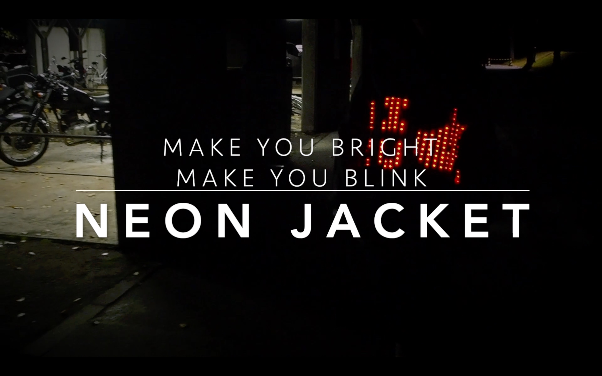

日本最大級ハードウェアコンテストGUGEN2019 に応募した作品です 

イベントリンク> [日本最大級ハードウェアコンテストGUGEN2019 踊れる光 - NEON Jacket -](https://gugen.jp/entry2019/2019-053)

<iframe width="560" height="315" src="https://www.youtube.com/embed/8wwoMu8pbZU" frameborder="0" allow="accelerometer; autoplay; encrypted-media; gyroscope; picture-in-picture" allowfullscreen></iframe>

## 作品概要
光るLEDネオンジャケット ボタン１つで３つのモードに切り換えることができます。 　

#### モード１: DANCE MODE
手首のモーションセンサで取得した角度や速さによって色と光り方が変わります 　

#### モード２: HEART RATE MODE 
手首のパルスセンサで取得した心拍数に合わせて光が踊ります 　

#### モード３: SPONSOR MODE
電光掲示板のような使い方ができます 

## 使用したデバイス
arduino nano センサー (モーションセンサ / パルスセンサ) LED 

## ターゲットユーザー
体を動かすことが好きな方 自分を光らせたい方 

## ターゲットユーザーに与える価値
体のあらゆる情報を目に見える形で発信することができるネオンジャケット。ジムでの運動やライブ会場、使い方次第で自分が主役になったり掲示板になったりと、体を動かすことがもっと楽しくなるでしょう。また、自分をメディアにするという新しい概念や、表現の枠がもっと広がります。

<!-- 
# 初めてのプロジェクト
# h1
## h2
### h3
#### h4
##### h5

テキストテキスト

1. テキスト
`テキスト`
- 箇条書き
    - 箇条書き

>引用
    >引用

***
*斜体*
**太字**
~~打ち消し~~
赤のテキスト -->