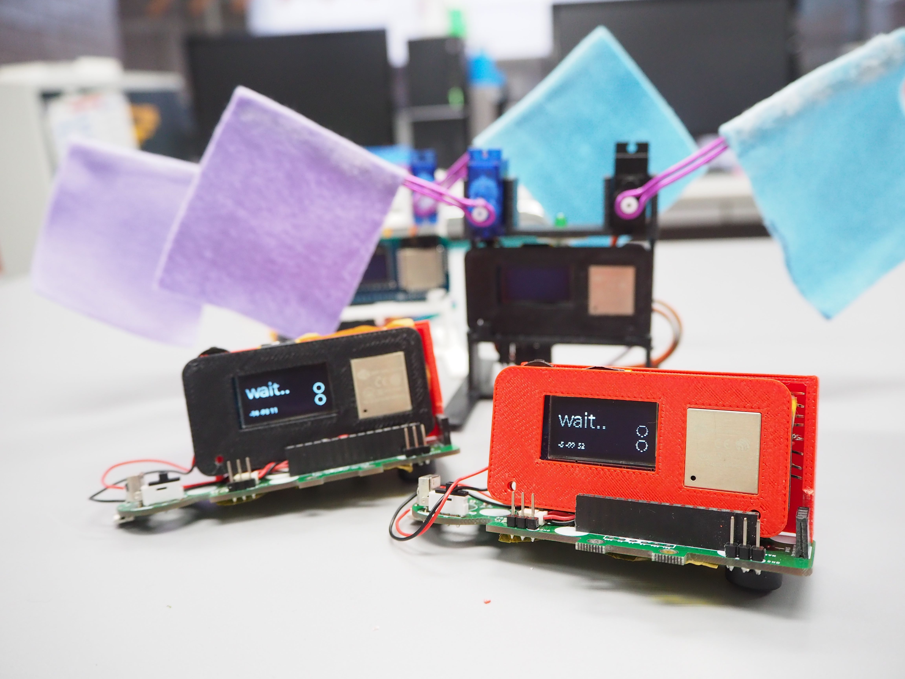

日本最大級ハードウェアコンテストGUGEN2019 に応募した作品です 

イベントリンク> [Come on, man](https://gugen.jp/entry2019/2019-031)

<iframe width="560" height="315" src="https://www.youtube.com/embed/ehJ_DnTVqsE" frameborder="0" allow="accelerometer; autoplay; encrypted-media; gyroscope; picture-in-picture" allowfullscreen></iframe>

## 作品概要
日本の手遊びを遠隔で遊べるようにしたツールです。 コントローラの動かし方次第で攻撃・防御・チャージを繰り出すことができます。コントローラはバッテリー搭載、ディスプレイで技判定と点数表示。また、Wi-fiで接続しているためインターネットがあればどこからでも通信できます。タイミングと勝敗判定は親機が旗で合図してくれます。伝統と技術を融合した玩具、遊んでみませんか？

## ルール
プレイ人数 : ２人 先に２回勝った方が勝ちです。 

1. 攻撃するごとにチャージ１回消費します。チャージなしで攻撃できません 
2. チャージは３回まで 
3. 防御は連続２回まで 

## 使用したデバイス
obniz

## ターゲットユーザー
周りはスイッチとかで遊んでるけど本当は昔ながらの遊びが好きで、それだと乗り遅れるから地味に見えて実は最先端技術が搭載しているんだぜ感を出したい子供または社会人

## ターゲットユーザーに与える価値
オフィスなど大きな声ではしゃげない場でも、誰の迷惑かけることなく静かに手遊び王世界一決定戦が開催できます。 手を動かすという本来の面白ポイントを生かしつつ、正確に点数をカウントし勝敗判定ができます。 どうやったら勝てるか戦略を立てなければいけないので、ちょっとした脳トレになります。