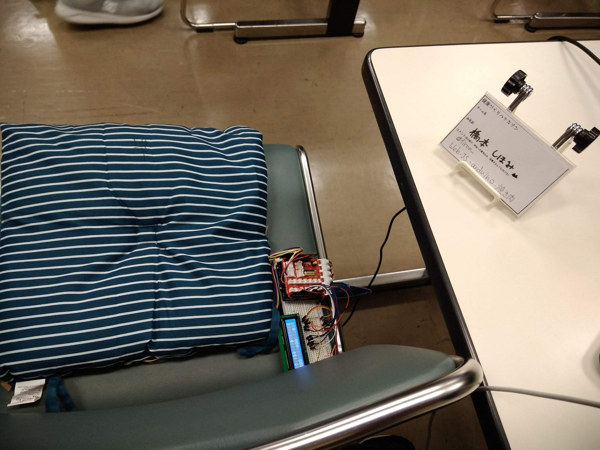

健康づくりハッカソン2018に応募した作品かつ人生で初めて参加したハッカソン&初めて作った思い出のデバイスになります 

「健康＋音楽＋ゲーム」をコンセプトに１週間開発。
座布団に4つの圧力センサーがついており、その上に座るとWebアプリと連動して自分の重心がどの位置か計算してくれます。 Webアプリはゲーム式になっており、スタートを押すと音楽が流れ、リズムカルに棒が降りてきます。その棒に合わせてうまく重心を傾けるとスコアが加点されます。 仕事したまま、座ったままでできる全身を使った音ゲーになります。 地味に見えますがこれが意外と太ももに力が入り、筋トレになるんですね